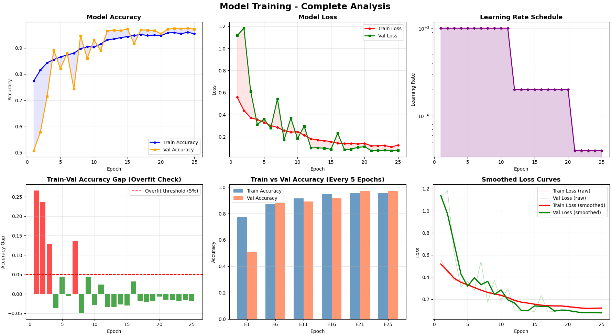
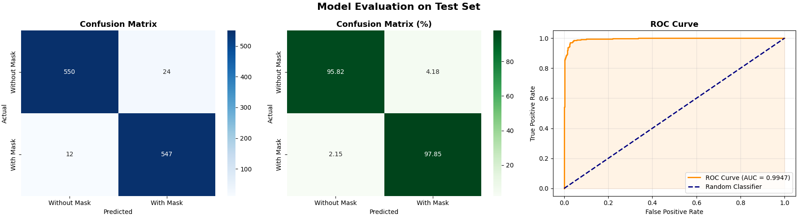
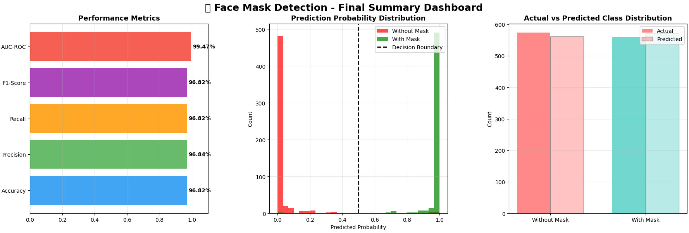
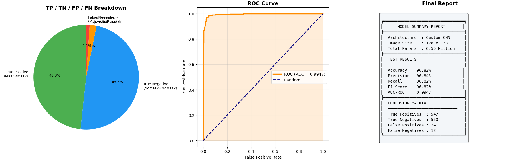
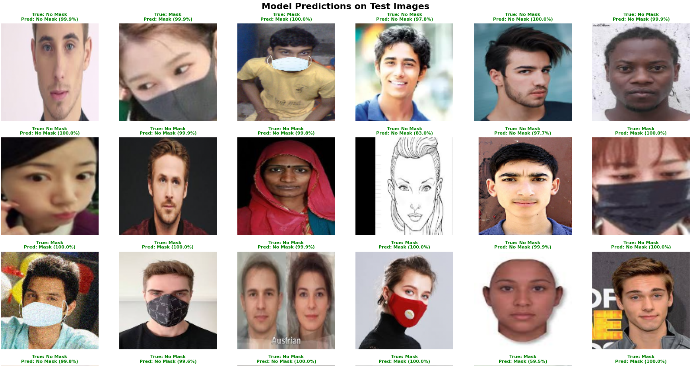

# 🎭 MaskSense AI - Face Mask Detection using CNN

> A deep learning binary image classifier that detects whether a person is wearing a face mask or not, built from scratch using a custom Convolutional Neural Network (CNN) with TensorFlow/Keras — now deployable as a stunning interactive web app via **Streamlit**.

---

## 📋 Table of Contents

- [Project Overview](#project-overview)
- [Dataset](#dataset)
- [Project Structure & Pipeline](#project-structure--pipeline)
- [Data Preprocessing](#data-preprocessing)
- [Data Augmentation](#data-augmentation)
- [Model Architecture](#model-architecture)
- [Training Configuration](#training-configuration)
- [Training Results](#training-results)
- [Evaluation & Metrics](#evaluation--metrics)
- [Visualizations](#visualizations)
- [Tech Stack](#tech-stack)
- [Installation & Setup](#installation--setup)
- [🚀 Streamlit Web App Deployment](#-streamlit-web-app-deployment)
- [Usage](#usage)
- [Results Summary](#results-summary)

---

## 🔍 Project Overview

| Property | Details |
|---|---|
| **Problem Type** | Binary Image Classification |
| **Input** | Face images (128 × 128 × 3) |
| **Output** | `With Mask (1)` / `Without Mask (0)` |
| **Framework** | TensorFlow 2.19 / Keras 3.13 |
| **Dataset** | Kaggle — `omkargurav/face-mask-dataset` |
| **Final Test Accuracy** | **96.82%** |
| **AUC-ROC Score** | **0.9965** |

This project implements an end-to-end deep learning pipeline for face mask detection — from raw image loading and preprocessing, through data augmentation and model training with callbacks, to full evaluation with classification reports, confusion matrices, and ROC curve analysis.

---

## 📦 Dataset

- **Source:** [Kaggle Face Mask Dataset](https://www.kaggle.com/datasets/omkargurav/face-mask-dataset) via `kagglehub`
- **Total Images:** 7,553

| Class | Count |
|---|---|
| With Mask | 3,725 |
| Without Mask | 3,828 |
| **Total** | **7,553** |

The dataset is well-balanced with a near-equal distribution across both classes, meaning no special handling for class imbalance (e.g., class weighting or oversampling) was required. Images are stored in two separate directories: `with_mask/` and `without_mask/`.

---

## 🔁 Project Structure & Pipeline

```
Dataset (7,553 images)
      ↓
Data Exploration & Visualization
      ↓
Preprocessing (OpenCV: BGR→RGB → Resize 128×128 → Normalize ÷255)
      ↓
Stratified Train / Val / Test Split (70% / 15% / 15%)
      ↓
Data Augmentation (Training set only — via ImageDataGenerator)
      ↓
Custom CNN Architecture (3 Conv Blocks + 2 Dense Layers)
      ↓
Model Training (Adam, Binary Crossentropy, 25 Epochs)
      ↓
Callbacks: EarlyStopping + ReduceLROnPlateau + ModelCheckpoint
      ↓
Best Model Saved → best_mask_model.keras
      ↓
Evaluation: Accuracy / Precision / Recall / F1 / AUC-ROC / Confusion Matrix
      ↓
✅ Test Accuracy: 96.82% | AUC-ROC: 0.9965
      ↓
🌐 Streamlit Web App (app.py) — Interactive Deployment
```

---

## 🧹 Data Preprocessing

Each image goes through the following preprocessing steps before being fed into the model:

```
Raw Image → Read with OpenCV → BGR to RGB → Resize (128×128) → Normalize (÷255) → NumPy Array
```

| Step | Details |
|---|---|
| **Library** | OpenCV (`cv2`) |
| **Color Conversion** | BGR → RGB (OpenCV reads in BGR by default) |
| **Resize** | All images resized to `128 × 128` pixels |
| **Normalization** | Pixel values scaled from `[0, 255]` → `[0.0, 1.0]` |
| **Label Encoding** | With Mask → `1`, Without Mask → `0` |
| **Final Data Shape** | `(7553, 128, 128, 3)` |
| **Error Handling** | Corrupted/unreadable images are caught via try/except and skipped |

---

## ✂️ Dataset Splitting

Stratified splitting is used throughout to ensure each split maintains the original class ratio.

```
Total: 7,553 images
│
├── Train Set      → 5,290 images  (70%)
│     ├── With Mask:    2,609
│     └── Without Mask: 2,681
│
├── Validation Set → 1,130 images  (15%)
│     ├── With Mask:    557
│     └── Without Mask: 573
│
└── Test Set       → 1,133 images  (15%)
      ├── With Mask:    559
      └── Without Mask: 574
```

**Implementation:** A two-stage `train_test_split` is used with `stratify=labels` and `random_state=42` for reproducibility.

1. First split: 85% train+val, 15% test
2. Second split: from the 85%, 70% train and 15% val (using `test_size=0.176` to reach 15% of total)

---

## 🔀 Data Augmentation

Augmentation is applied **only to the training set** via Keras `ImageDataGenerator` to improve generalization and reduce overfitting. The validation and test sets receive **no augmentation** — only the normalization already applied during preprocessing.

| Technique | Value |
|---|---|
| Rotation Range | ±20° |
| Width Shift | 0.2 (20%) |
| Height Shift | 0.2 (20%) |
| Shear Range | 0.2 |
| Zoom Range | 0.2 |
| Horizontal Flip | True |
| Fill Mode | `nearest` |

Augmented images are streamed in real time during training via `train_datagen.flow()` — no augmented images are saved to disk.

---

## 🧠 Model Architecture

A custom Sequential CNN with 3 convolutional blocks followed by fully connected layers.

```
Input (128 × 128 × 3)
│
├── Block 1
│     Conv2D(32 filters, 3×3, ReLU)
│     BatchNormalization
│     MaxPooling2D(2×2)            → Output: (63×63×32)
│     Dropout(0.25)
│
├── Block 2
│     Conv2D(64 filters, 3×3, ReLU)
│     BatchNormalization
│     MaxPooling2D(2×2)            → Output: (30×30×64)
│     Dropout(0.25)
│
├── Block 3
│     Conv2D(128 filters, 3×3, ReLU)
│     BatchNormalization
│     MaxPooling2D(2×2)            → Output: (14×14×128)
│     Dropout(0.25)
│
├── Flatten → (25,088 units)
│
├── Dense(256, ReLU)
│     BatchNormalization
│     Dropout(0.5)
│
├── Dense(128, ReLU)
│     Dropout(0.5)
│
└── Dense(1, Sigmoid) → Output: probability ∈ [0, 1]
```

### Architecture Design Decisions

| Component | Rationale |
|---|---|
| **Doubling filters (32→64→128)** | Learns increasingly complex features at each depth level |
| **BatchNormalization** | Stabilizes and accelerates training; reduces internal covariate shift |
| **MaxPooling** | Reduces spatial dimensions and provides translational invariance |
| **Dropout(0.25) in conv blocks** | Light regularization to prevent overfitting in feature maps |
| **Dropout(0.5) in dense layers** | Stronger regularization in fully connected layers where overfitting risk is highest |
| **Sigmoid output** | Produces probability output for binary classification |
| **Binary Crossentropy** | Standard loss for binary classification tasks |

### Model Parameters

| Parameter Type | Count |
|---|---|
| Total Parameters | 6,550,977 (~6.55M) |
| Trainable Parameters | 6,550,017 |
| Non-trainable Parameters | 960 (BatchNorm statistics) |
| Model Size | ~24.99 MB |

---

## ⚙️ Training Configuration

| Hyperparameter | Value |
|---|---|
| **Loss Function** | Binary Crossentropy |
| **Optimizer** | Adam |
| **Initial Learning Rate** | 0.001 |
| **Batch Size** | 32 |
| **Max Epochs** | 25 |
| **Metrics** | Accuracy |

### Callbacks

Three callbacks were configured to automate training control:

| Callback | Configuration | Purpose |
|---|---|---|
| **EarlyStopping** | `monitor=val_loss`, `patience=5`, `restore_best_weights=True` | Stops training if validation loss doesn't improve for 5 epochs; restores best weights |
| **ReduceLROnPlateau** | `monitor=val_loss`, `factor=0.2`, `patience=3`, `min_lr=1e-6` | Reduces LR by 80% when val_loss plateaus for 3 epochs |
| **ModelCheckpoint** | `monitor=val_accuracy`, `save_best_only=True` → `best_mask_model.keras` | Saves model weights whenever validation accuracy improves |

---

## 🧠 Model Training Plots



## 📈 Training Results

### Learning Rate Schedule (Auto-adjusted by ReduceLROnPlateau)

| Epoch Range | Learning Rate |
|---|---|
| Epoch 1–10 | 0.001000 |
| Epoch 11–20 | 0.000200 |
| Epoch 21–25 | 0.000040 |

---

## 📊 Evaluation & Metrics

## 📊 Evaluation Plots



The final model is evaluated on the held-out **test set (1,133 images)** — data the model has never seen during training or validation.

### Overall Test Performance

| Metric | Score |
|---|---|
| **Test Accuracy** | **96.82%** |
| **Precision (Weighted)** | **97.00%** |
| **Recall (Weighted)** | **97.00%** |
| **F1-Score (Weighted)** | **97.00%** |
| **AUC-ROC** | **0.9965** |

### Per-Class Performance

| Class | Precision | Recall | F1-Score | Support |
|---|---|---|---|---|
| Without Mask (0) | 0.98 | 0.96 | 0.97 | 574 |
| With Mask (1) | 0.96 | 0.98 | 0.97 | 559 |
| **Weighted Average** | **0.97** | **0.97** | **0.97** | **1,133** |

### Confusion Matrix

```
                      Predicted
                  No Mask   With Mask
Actual  No Mask  [  551        23   ]
       With Mask [   13       546   ]
```

| Metric | Value |
|---|---|
| True Positives (TP) — Mask correctly identified as Mask | 546 |
| True Negatives (TN) — No Mask correctly identified as No Mask | 551 |
| False Positives (FP) — No Mask wrongly predicted as Mask | 23 |
| False Negatives (FN) — Mask wrongly predicted as No Mask | 13 |
| **Total Misclassifications** | **36 / 1,133** |

---

## 📈 Final Summary Dashboard



## 📊 Final Summary Dashboard (Detailed)



## 🖼️ Model Predictions on Test Images



## 📉 Visualizations

The notebook generates the following visualizations:

| Plot | Description |
|---|---|
| **Sample Dataset Images** | 2×5 grid showing sample `With Mask` and `Without Mask` images |
| **Augmented Images** | 5 augmented versions of a single training image |
| **Training Accuracy Curve** | Train vs. Validation accuracy over epochs |
| **Training Loss Curve** | Train vs. Validation loss over epochs |
| **Learning Rate Schedule** | Log-scale LR plot showing plateau-triggered reductions |
| **Overfitting Check (Bar Chart)** | Train–Val accuracy gap per epoch |
| **Epoch-wise Accuracy Comparison** | Grouped bar chart every 5 epochs |
| **Smoothed Loss Curves** | Raw + smoothed loss using uniform filter |
| **Confusion Matrix (Counts)** | Heatmap with raw prediction counts |
| **Confusion Matrix (Percentages)** | Heatmap with row-normalized percentages |
| **ROC Curve** | False Positive Rate vs True Positive Rate with AUC annotation |
| **Prediction Probability Distribution** | Histogram of sigmoid outputs split by class |
| **Test Predictions Grid** | 4×6 grid of 24 test images with true/predicted labels |
| **Misclassified Images** | 3×6 grid showing all 36 misclassified images |
| **Final Summary Dashboard** | 6-panel dashboard combining all key metrics and plots |

---

## 🛠️ Tech Stack

| Tool | Version | Purpose |
|---|---|---|
| **Python** | 3.12 | Core language |
| **TensorFlow** | 2.19.0 | Deep learning framework |
| **Keras** | 3.13.2 | High-level model API |
| **NumPy** | 2.0.2 | Array operations |
| **OpenCV** (`cv2`) | Latest | Image loading and color conversion |
| **Scikit-learn** | Latest | Train/test split, metrics (precision, recall, F1, confusion matrix, ROC) |
| **Matplotlib** | Latest | Training curves and evaluation plots |
| **Seaborn** | Latest | Confusion matrix heatmaps |
| **Pillow** (`PIL`) | Latest | Displaying sample dataset images |
| **KaggleHub** | Latest | Automated dataset download |
| **SciPy** | Latest | Smoothing loss curves (`uniform_filter1d`) |
| **Streamlit** | ≥1.35.0 | Interactive web app deployment |

---

## 🚀 Streamlit Web App Deployment

The trained model is packaged into a professional, interactive Streamlit web application (`app.py`) with a dark-themed, production-grade UI.

### 🌐 App Features

| Feature | Description |
|---|---|
| **🔬 Detection Page** | Upload a face image and get instant mask/no-mask prediction with confidence score |
| **📊 About the Project** | Full project description — dataset, pipeline, preprocessing, insights |
| **🧠 Model Architecture** | Layer-by-layer visual breakdown of the CNN with parameter counts |
| **📈 Performance** | Interactive confusion matrix, per-class metrics, and learning rate schedule |
| **⚙️ Decision Threshold Slider** | Adjust the classification threshold (0.3–0.9) for safety-critical deployments |
| **📊 Dual Probability Bars** | Visual output showing confidence for both classes simultaneously |

### 📁 Project Files for Deployment

```
face-mask-detection/
├── app.py                      ← Streamlit application
├── best_mask_model.keras       ← Trained CNN model (~25 MB)
├── project_face_mask_detection_CNN_notebook.ipynb ← Training notebook
├── requirements.txt            ← Python dependencies
└── README.md                   ← This file
```

### ⚡ Quick Start — Run Locally

#### 1. Clone / Download the Project

```bash
git clone https://github.com/VPPranav/Face_mask_detection_CNN.git
cd Face_mask_detection_CNN
```

#### 2. Install Dependencies

```bash
pip install -r requirements.txt
```

> **Note:** Use `opencv-python-headless` (not `opencv-python`) for server/headless deployments to avoid GUI dependencies.

#### 3. Ensure Model File is Present

Make sure `best_mask_model.keras` is in the **same directory** as `app.py`:

```
face-mask-detection/
├── app.py
├── best_mask_model.keras   ← Required
└── requirements.txt
```

#### 4. Launch the App

```bash
streamlit run app.py
```

The app will open in your browser at `http://localhost:8501`.

---

### ☁️ Deploy to Streamlit Community Cloud (Free)

1. Push your project to a **public GitHub repository** containing:
   - `app.py`
   - `best_mask_model.keras`
   - `requirements.txt`

2. Go to [share.streamlit.io](https://share.streamlit.io) and sign in with GitHub.

3. Click **"New app"**, select your repository, branch, and set the main file to `app.py`.

4. Click **"Deploy"** — your app will be live at a public URL within minutes.

> 💡 **Tip:** Streamlit Community Cloud provides 1 GB RAM by default. The model (~25 MB) loads well within this limit.

---

### 🐳 Deploy with Docker (Optional)

```dockerfile
FROM python:3.12-slim

WORKDIR /app

COPY requirements.txt .
RUN pip install --no-cache-dir -r requirements.txt

COPY app.py .
COPY best_mask_model.keras .

EXPOSE 8501

CMD ["streamlit", "run", "app.py", "--server.port=8501", "--server.address=0.0.0.0"]
```

Build and run:

```bash
docker build -t masksense-ai .
docker run -p 8501:8501 masksense-ai
```

---

### 🔧 Inference Logic (Inside the App)

The app replicates the exact preprocessing pipeline used during training:

```python
import cv2
import numpy as np
from PIL import Image
import tensorflow as tf

# Load model (cached by Streamlit)
model = tf.keras.models.load_model("best_mask_model.keras")

# Preprocess uploaded image
def preprocess_image(image: Image.Image):
    img = np.array(image.convert("RGB"))   # PIL → NumPy, ensure RGB
    img = cv2.resize(img, (128, 128))       # Resize to model input size
    img = img / 255.0                       # Normalize to [0, 1]
    return np.expand_dims(img, axis=0)      # Add batch dim → (1, 128, 128, 3)

# Predict
img_array = preprocess_image(uploaded_image)
raw_prob = float(model.predict(img_array)[0][0])   # Sigmoid output

# Apply threshold (default 0.5, adjustable via UI slider)
threshold = 0.5
label = "With Mask" if raw_prob > threshold else "Without Mask"
confidence = raw_prob if raw_prob > threshold else 1 - raw_prob
```

---

## 💻 Usage

### Running Inference on a New Image (Script)

After training, load the saved model and run a prediction:

```python
import tensorflow as tf
import cv2
import numpy as np

# Load the saved model
model = tf.keras.models.load_model('best_mask_model.keras')

# Load and preprocess an image
img = cv2.imread('your_image.jpg')
img = cv2.cvtColor(img, cv2.COLOR_BGR2RGB)
img = cv2.resize(img, (128, 128))
img = img / 255.0
img = np.expand_dims(img, axis=0)  # Add batch dimension → (1, 128, 128, 3)

# Predict
pred_prob = model.predict(img)[0][0]
pred_label = "With Mask" if pred_prob > 0.5 else "Without Mask"
confidence = pred_prob if pred_prob > 0.5 else 1 - pred_prob

print(f"Prediction : {pred_label}")
print(f"Confidence : {confidence * 100:.2f}%")
```

### Decision Boundary

The model uses a sigmoid output. The default decision threshold is `0.5`:

| Sigmoid Output | Prediction |
|---|---|
| > 0.5 | With Mask (1) |
| ≤ 0.5 | Without Mask (0) |

> **Tip:** For safety-critical deployments, you can raise the threshold (e.g., `0.7`) via the sidebar slider in the Streamlit app to reduce false negatives (undetected unmasked faces).

---

## 📌 Key Observations & Insights

- The model achieved **96.82% test accuracy** with strong generalization — the gap between training accuracy (95.94%) and test accuracy (96.82%) shows no overfitting.
- **AUC-ROC of 0.9965** indicates near-perfect separability between the two classes.
- **BatchNormalization** in every convolutional block was critical for stable training — the model converged smoothly without loss spikes.
- **ReduceLROnPlateau** was the single most impactful callback — accuracy jumped from ~89% → ~97% after the first learning rate reduction at Epoch 10.
- Only **36 misclassifications** out of 1,133 test images — 23 false positives (no mask predicted as mask) and 13 false negatives (mask predicted as no mask).
- Both classes achieved an identical **F1-score of 0.97**, confirming the model has no class bias despite the slightly unequal class distribution.
- The prediction probability distribution shows strong bimodal separation — most predictions cluster near 0.0 or 1.0, not near the 0.5 boundary, indicating high-confidence predictions.

---

## 📁 Output Files

| File | Description |
|---|---|
| `best_mask_model.keras` | Best model checkpoint saved by `ModelCheckpoint` (monitored on `val_accuracy`) |
| `app.py` | Streamlit web application for interactive deployment |
| `requirements.txt` | Python dependencies for the Streamlit app |

---

## 📊 Results Summary

```
┌──────────────────────────────────────┐
│       FINAL MODEL REPORT             │
├──────────────────────────────────────┤
│  Architecture  : Custom 3-Block CNN  │
│  Image Size    : 128 × 128 × 3       │
│  Parameters    : ~6.55 Million       │
│  Model Size    : ~24.99 MB           │
├──────────────────────────────────────┤
│  TEST SET RESULTS (1,133 images)     │
│  ──────────────────────────────────  │
│  Accuracy   :  96.82%                │
│  Precision  :  97.00%                │
│  Recall     :  97.00%                │
│  F1-Score   :  97.00%                │
│  AUC-ROC    :  0.9965                │
├──────────────────────────────────────┤
│  CONFUSION MATRIX                    │
│  ──────────────────────────────────  │
│  True Positives  : 546               │
│  True Negatives  : 551               │
│  False Positives : 23                │
│  False Negatives : 13                │
│  Total Errors    : 36 / 1,133        │
├──────────────────────────────────────┤
│  STREAMLIT DEPLOYMENT                │
│  ──────────────────────────────────  │
│  App File      : app.py              │
│  Launch        : streamlit run app.py│
│  Default Port  : localhost:8501      │
└──────────────────────────────────────┘
```

---

## 📄 License

Developed by **Pranav V P** as an Internship Project.

This project is for educational and academic purposes. The dataset is sourced from Kaggle under its respective terms of use.

---

*Pipeline documented end-to-end for reproducibility and academic submission.*
